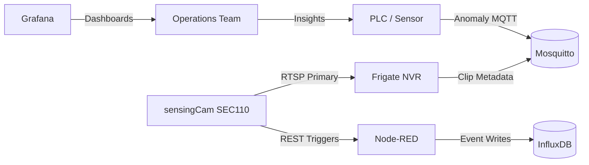
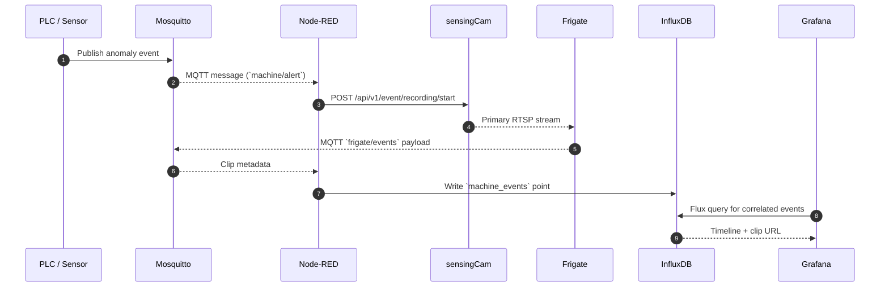
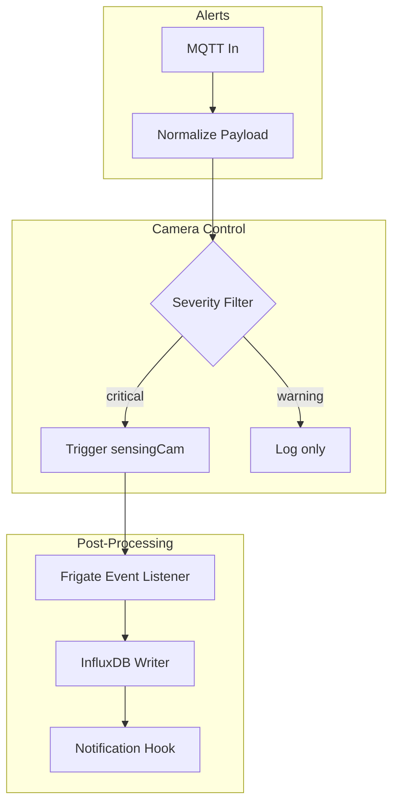

# sensingCam MING Starter

> A batteries-included reference stack for orchestrating a SICK sensingCam SEC110 inside a MING (MQTT, InfluxDB, Node-RED, Grafana) edge deployment with Frigate as the recorder.

---

## Table of Contents

1. [Why this Starter Exists](#why-this-starter-exists)
2. [System-at-a-Glance](#system-at-a-glance)
3. [Architecture Overview](#architecture-overview)
4. [Fast Track: Bring-Up Checklist](#fast-track-bring-up-checklist)
5. [Service Inventory](#service-inventory)
6. [Automation Flow](#automation-flow)
7. [Operational Dashboards](#operational-dashboards)
8. [Scripts & Utilities](#scripts--utilities)
9. [Extended Documentation](#extended-documentation)
10. [Official Resources](#official-resources)
11. [License](#license)

---

## Why this Starter Exists

Industrial teams often have to stitch together PLC alarm streams, IP cameras, and plant-floor dashboards under aggressive timelines. The sensingCam SEC110 ships with powerful features (dual RTSP, REST control API, circular buffer), yet the integration story can be daunting. This starter repository gives you:

- A **repeatable Docker Compose stack** that mirrors the MING reference architecture.
- **Opinionated defaults** for Frigate recording, Node-RED automations, and Grafana dashboards.
- **Living documentation** that explains the "why" behind each component so you can adapt it to your own plant.

Keep the stack in version control, fork it to match your environment, and treat the docs as onboarding material for engineers and operators alike.

---

## System-at-a-Glance

> **Visual Legend:** Blue circles are stateful services, rectangles are stateless logic, and gray node denotes human interaction.

---

## Architecture Overview

The stack mirrors a layered edge deployment where deterministic PLC events are converted into video context and surfaced in Grafana. The detailed design is maintained in [`docs/ARCHITECTURE.md`](docs/ARCHITECTURE.md), but the highlights are:

- **Trigger Path:** PLC → Mosquitto → Node-RED → sensingCam REST API.
- **Video Path:** sensingCam → Frigate (primary RTSP) → Frigate media store → Grafana panels.
- **Telemetry Path:** Frigate MQTT → Node-RED → InfluxDB → Grafana Flux queries.

---

## Fast Track: Bring-Up Checklist

Follow this condensed checklist to move from clone → first event in under an hour:

1. **Bootstrap configuration**
   - Copy `.env.example` → `.env` and populate credentials.
   - Create a persistent directory (`./media`) for Frigate recordings.
   - Adjust `frigate/config.yml` with the sensingCam IP and RTSP credentials.
2. **Prepare secrets**
   - Rotate *all* default passwords before deployment (Grafana, InfluxDB, Mosquitto, Node-RED admin).
   - Store long-lived API tokens in Docker secrets or an external vault.
3. **Launch the stack**
   - `docker compose up -d`
   - Verify container health via `scripts/verify_stack.sh`.
4. **Load automations**
   - Import `nodered/flows.json` through the Node-RED editor (or mount at `/data/flows.json`).
   - Configure Node-RED environment variables for MQTT and camera credentials.
5. **Validate end-to-end**
   - Trigger a PLC anomaly (or `scripts/test_camera_api.sh`) to kick off a camera recording.
   - Confirm the clip shows in Frigate and that Grafana displays the correlated event.

> Need more context? Dive into [`docs/OPERATIONS.md`](docs/OPERATIONS.md) for day-two procedures.

---

## Service Inventory

| Service   | Container | Purpose | Default Port(s) | Persistence |
|-----------|-----------|---------|-----------------|-------------|
| Mosquitto | `mosquitto` | MQTT broker for PLC alarms and Frigate events. | `1883/tcp` | `/var/lib/mosquitto` volume |
| Node-RED  | `nodered`   | Automation workflows that invoke camera REST APIs and write to InfluxDB. | `1880/tcp` | `/data` volume |
| InfluxDB  | `influxdb`  | Time-series database for `machine_events` measurement. | `8086/tcp` | `/var/lib/influxdb2` |
| Grafana   | `grafana`   | Visualization layer with event timelines and clip playback. | `3000/tcp` | `/var/lib/grafana` |
| Frigate   | `frigate`   | NVR that ingests RTSP stream, stores clips, and restreams for Grafana. | `8554/tcp`, `8971/tcp` | `/media`, `/config` |

Additional folders:

- [`frigate/`](frigate) – Frigate camera configuration.
- [`nodered/`](nodered) – Exported flows for automation logic.
- [`grafana/`](grafana) – Provisioned dashboards and data sources.
- [`scripts/`](scripts) – Bash utilities to validate and exercise the integration.

---

## Automation Flow

Node-RED is the glue that synchronizes PLC signals with camera control and metadata ingestion. The default flow (imported from `nodered/flows.json`) is structured as follows:

1. **MQTT In**: Subscribes to `machine/alerts/#` topics from PLCs.
2. **Event Normalizer**: Standardizes payloads into `{line, station, severity}` fields.
3. **Camera Trigger**: Issues `POST /api/v1/event/recording/start` to the sensingCam with pre/post-roll durations.
4. **Frigate Listener**: Watches `frigate/events` topic for clip completion notifications.
5. **InfluxDB Writer**: Persists event metadata with tags for quick dashboard filtering.
6. **Notification Hook (optional)**: Extendable node to push alerts into Teams/Slack or MES systems.

Use Node-RED environment variables (`SENSINGCAM_HOST`, `SENSINGCAM_USER`, etc.) instead of hard-coding secrets inside flow nodes.

---

## Operational Dashboards

Grafana ships with a starter dashboard that correlates InfluxDB measurements with Frigate media. Customize it by adding:

- **Timeline panel** showing `machine_events` grouped by production line.
- **Stat panel** summarizing last anomaly per station.
- **Embedded stream panel** pointing to Frigate's `/live/<camera>` restream.
- **Ad-hoc filters** for severity, line, and shift.

> Tip: When embedding Frigate streams, enable signed URLs or IP restrictions at the proxy to prevent unauthorized access.

For deeper observability, consider enabling:

- InfluxDB tasks that downsample older data.
- Grafana alert rules that post to on-call channels when event frequency spikes.
- Loki or another log stack (not included) for centralizing container logs.

---

## Scripts & Utilities

| Script | Purpose | Usage |
|--------|---------|-------|
| [`scripts/test_camera_api.sh`](scripts/test_camera_api.sh) | Exercises the sensingCam REST endpoint using HTTP digest auth; great for validating credentials. | `./scripts/test_camera_api.sh https://camera-ip api-user api-pass` |
| [`scripts/seed_influx_bucket.sh`](scripts/seed_influx_bucket.sh) | Writes a sample point to InfluxDB for dashboard bootstrapping. | `./scripts/seed_influx_bucket.sh` |
| [`scripts/verify_stack.sh`](scripts/verify_stack.sh) | Checks container status, health endpoints, and essential ports after deployment. | `./scripts/verify_stack.sh` |

Extend the `scripts/` directory with Ansible playbooks or Python utilities as your deployment matures.

---

## Extended Documentation

The `docs/` directory contains in-depth guides:

- [`ARCHITECTURE.md`](docs/ARCHITECTURE.md) – Component deep dive, topology diagrams, and data models.
- [`NETWORKING.md`](docs/NETWORKING.md) – VLAN layout, firewall policy, and port reference.
- [`SECURITY.md`](docs/SECURITY.md) – Hardening checklist and compliance pointers.
- [`ROADMAP.md`](docs/ROADMAP.md) – Suggested maturity milestones from PoC to production.
- [`OPERATIONS.md`](docs/OPERATIONS.md) – Day-two operations, backups, and troubleshooting playbooks.
- [`CAMERA_GUIDE.md`](docs/CAMERA_GUIDE.md) – Recommended sensingCam configuration and diagnostics.

Each document is self-contained so you can hand it to specialists (network engineers, security, operations) without additional context.

---

## Official Resources

### Primary (Official SICK) Resources

| Title | Description | Link |
| ----- | ----------- | ---- |
| **Operating Instructions – sensingCam SEC100 / SEC110 (2025-03)** | Full installation, configuration, network services (RTSP, MJPEG, SSH, NTP), REST API overview, image handling, and technical specs. | [https://www.auser.fi/wp-content/uploads/sensingcam-sec100-sec110-operating-instructions.pdf](https://www.auser.fi/wp-content/uploads/sensingcam-sec100-sec110-operating-instructions.pdf) |
| **Product Page – sensingCam SEC100** | Official catalog entry with overview, accessories, firmware, datasheets, and manuals under the *Downloads* tab. | [https://www.sick.com/au/en/products/machine-vision-and-identification/machine-vision/sensingcam-sec100/c/g601993?tab=downloads](https://www.sick.com/au/en/products/machine-vision-and-identification/machine-vision/sensingcam-sec100/c/g601993?tab=downloads) |
| **Datasheet – SEC110-5C9D1SFZZZZ (1144993)** | Electrical, mechanical, optical, and environmental specifications for the sensingCam family. | [https://www.sick.com/media/pdf/0/20/220/dataSheet_SEC110-5C9D1SFZZZZ_1144993_en.pdf](https://www.sick.com/media/pdf/0/20/220/dataSheet_SEC110-5C9D1SFZZZZ_1144993_en.pdf) |
| **REST API of the sensingCam SEC100** | Core developer reference for HTTP API endpoints, challenge-response auth, and downloadable Postman/Insomnia collections + Python examples. | [https://support.sick.com/sick-knowledgebase/article/?code=KA-10054](https://support.sick.com/sick-knowledgebase/article/?code=KA-10054) |
| **deviceDescription.yaml (Download Guide)** | Explains how to retrieve the OpenAPI-style YAML from the camera (≥ FW 1.2.0 via HTTP or ≥ 2.0.2 via Web UI) for code generation. | [https://support.sick.com/sick-knowledgebase/article/?code=KA-09939](https://support.sick.com/sick-knowledgebase/article/?code=KA-09939) |
| **TCP/IP Commands for sensingCam SEC100** | Documents raw TCP command protocol (≥ FW 2.1.0) for snapshots/events; ideal for PLC/edge use cases. | [https://support.sick.com/sick-knowledgebase/article/?id=af210c9a-f7d2-4a36-8c88-af345059230e](https://support.sick.com/sick-knowledgebase/article/?id=af210c9a-f7d2-4a36-8c88-af345059230e) |
| **RTSP Stream Setup (VLC How-To)** | Step-by-step RTSP configuration guide (resolution, bitrate, frame rate) and VLC examples. | [https://support.sick.com/sick-knowledgebase/article/?id=69a3d053-2cc1-4d33-ad9e-6986c65d5aca](https://support.sick.com/sick-knowledgebase/article/?id=69a3d053-2cc1-4d33-ad9e-6986c65d5aca) |
| **Knowledge Article Collection – sensingCam Family** | Central index of FoV tools, stream tuning, Wi-Fi display, image settings, and network optimization guides. | [https://support.sick.com/knowledgebase/knowledge-articles/?gr0id=2065641c-a69b-ee11-be37-6045bd8c5a94&gr1id=31329239-a69b-ee11-be37-6045bdf3fa4f&gr2id=cd7ae574-bf7e-ef11-ac21-7c1e5251951a](https://support.sick.com/knowledgebase/knowledge-articles/?gr0id=2065641c-a69b-ee11-be37-6045bd8c5a94&gr1id=31329239-a69b-ee11-be37-6045bdf3fa4f&gr2id=cd7ae574-bf7e-ef11-ac21-7c1e5251951a) |
| **REST API (OpenAPI) Integration Primer for SICK Devices** | Generic REST/OpenAPI implementation guide and patterns for SICK devices. | [https://support.sick.com/sick-knowledgebase/article/?code=KA-09665](https://support.sick.com/sick-knowledgebase/article/?code=KA-09665) |
| **SICK AppSpace (SDK Docs + Developer Portal)** | SDK and developer portal for SICK ecosystem; useful for cross-device projects and AppSpace-enabled workflows. | [https://github.com/SICKAG/SICK-AppSpace-SDK-Docs](https://github.com/SICKAG/SICK-AppSpace-SDK-Docs)  •  [https://www.sick.com/de/en/sick-appspace-developers/s/sas-developers](https://www.sick.com/de/en/sick-appspace-developers/s/sas-developers) |
| **SICK PSIRT (Security Advisories + Practices)** | Official product security updates and hardening guidelines for SICK industrial devices. | [https://www.sick.com/cz/en/service-and-support/the-sick-product-security-incident-response-team-sick-psirt/w/psirt](https://www.sick.com/cz/en/service-and-support/the-sick-product-security-incident-response-team-sick-psirt/w/psirt)  •  [https://www.sick.com/cz/en/cybersecurity/s/cybersecurity/](https://www.sick.com/cz/en/cybersecurity/s/cybersecurity/) |

### Official Sample Code & Utilities (SICK GitHub)

| Title | Description | Link |
| ----- | ----------- | ---- |
| **SICK Scan REST Client (Python)** | Example client for SICK REST interfaces – auth flow, read/write variables, method calls – a great starting point for sensingCam integration. | [https://github.com/SICKAG/sick_scan_rest_client](https://github.com/SICKAG/sick_scan_rest_client) |
| **SICK AG – GitHub Organization**  | Index of all SICK AG open-source SDKs, samples, and integration tools. | [https://github.com/SICKAG](https://github.com/SICKAG) |

> **Tip:** The REST API article above includes downloadable Postman/Insomnia collections and Python example zip tailored specifically for sensingCam—grab those first. (support.sick.com)

---

## License

See [LICENSE](LICENSE).
