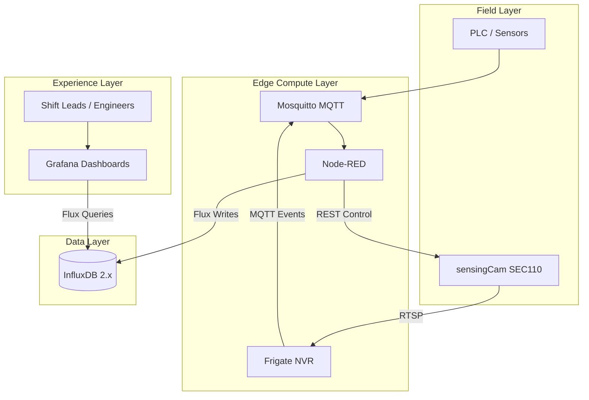
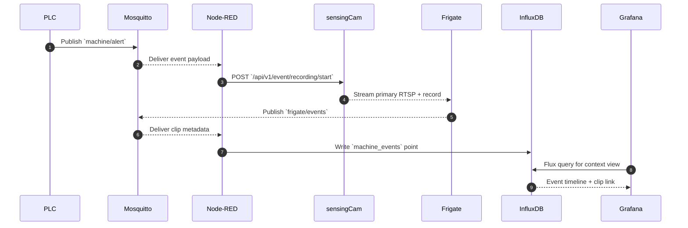
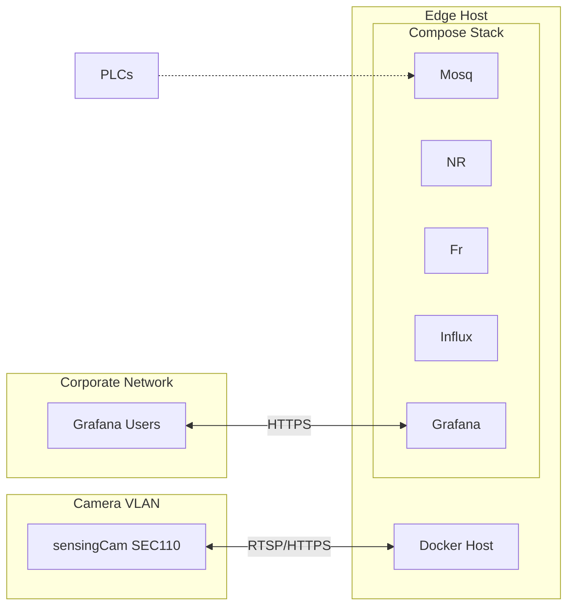

# sensingCam MING Starter Architecture

The starter stack connects a SICK sensingCam SEC110 to a MING (MQTT, InfluxDB, Node-RED, Grafana) edge deployment together with Frigate as the NVR. This document explains the design decisions, data flows, and extension points.

---

## Layered View



- **Field Layer**: Where deterministic signals originate and the camera physically resides.
- **Edge Compute Layer**: Services that react to signals, capture video, and publish metadata.
- **Data Layer**: Time-series storage optimized for query flexibility and retention policies.
- **Experience Layer**: Dashboards and people consuming the curated information.

---

## Component Responsibilities

| Component | Responsibilities | Notes |
|-----------|-----------------|-------|
| sensingCam SEC110 | Streams dual RTSP feeds, exposes REST API for event recordings, buffers 6 GB of rolling footage. | Configure pre/post-roll, codec, bitrate per use case. |
| Mosquitto | MQTT broker for ingesting PLC alarms and distributing Frigate clip notifications. | Use ACLs and TLS to separate publishers/consumers. |
| Node-RED | Orchestrates the automation pipeline, translating MQTT events into camera REST calls and InfluxDB writes. | Flows are stored in `nodered/flows.json`. |
| Frigate | Consumes the primary RTSP stream, writes clips to disk, and publishes metadata back to MQTT. | Configure `frigate/config.yml` with camera IP/credentials. |
| InfluxDB | Persists enriched machine events and camera clip metadata. | Uses Flux queries for dashboards; retention policies recommended. |
| Grafana | Visualizes timelines, embeds restreams, and exposes ad-hoc analytics to operators. | Provisioning located under `grafana/`. |

---

## Data Model

InfluxDB receives points in the `machine_events` measurement. Suggested schema:

```text
measurement: machine_events
  tags:
    line = "line01"
    station = "press-02"
    severity = "critical"
    camera = "sec110-l1"
  fields:
    message = "Emergency stop triggered"
    clip_path = "/media/frigate/recordings/line01/2025-02-15..."
    duration_sec = 22.5
    confidence = 0.87
```

- **Tags** are indexed and used for filtering (line, station, severity, camera).
- **Fields** carry payload metadata (message, clip path, durations, ML confidence).
- **Timestamps** default to the PLC anomaly timestamp; Node-RED should apply UTC.

---

## Event Sequence



Key timing considerations:

1. Configure the sensingCam's circular buffer to capture sufficient pre-roll (e.g., 10 seconds).
2. Ensure Node-RED waits for Frigate's `end` event before writing clip metadata.
3. Grafana panels should refresh at a cadence that balances operator needs with InfluxDB load.

---

## Extensibility Patterns

- **Multiple Cameras**: Add additional camera definitions in `frigate/config.yml` and replicate Node-RED trigger nodes with camera-specific credentials.
- **Advanced Analytics**: Forward Frigate object detection events to an external inference service via MQTT or HTTP nodes.
- **Hybrid Storage**: Mirror Frigate clips to S3/MinIO using Frigate's built-in uploaders for long-term retention.
- **Edge-to-Cloud Sync**: Use InfluxDB replication or Telegraf to push summarized metrics to a central historian.

---

## Deployment Topology



- Place the sensingCam on a dedicated VLAN with firewall rules that allow only Frigate and Node-RED to reach RTSP/REST endpoints.
- The Docker host can live on an application VLAN with controlled access to corporate networks.
- Grafana should be proxied with TLS termination and identity-aware access (SSO, reverse proxy auth).

---

## Volume & Storage Layout

| Service | Path | Contents |
|---------|------|----------|
| Frigate | `./media` | Camera recordings, snapshots, restream cache. Size accordingly for retention needs. |
| Node-RED | `./nodered/data` (via volume) | Flow definitions, credential store, editor state. |
| InfluxDB | `./influxdb` (via volume) | Buckets, tokens, task metadata. Snapshot for backups. |
| Grafana | `./grafana/data` (via volume) | SQLite database, plugin cache, provisioning overrides. |

Back up volumes regularly or mount to network storage if the edge host is not persistent.

---

## Configuration Sources

- `.env` – Centralized credentials and connection info consumed by Docker Compose and Node-RED.
- `frigate/config.yml` – Camera definitions, retention rules, recording profiles.
- `nodered/flows.json` – Automation graph; import via editor or mount to `/data/flows.json`.
- `grafana/provisioning/` – Datasource and dashboard definitions, version controlled.
- `scripts/*.sh` – Verification and bootstrap utilities.

Keep production secrets out of source control by using Docker secrets, environment files stored in a vault, or CI/CD injectors.

---

## Next Steps

- Review [`docs/NETWORKING.md`](NETWORKING.md) for VLAN assignments and firewall policies.
- Apply the hardening recommendations in [`docs/SECURITY.md`](SECURITY.md).
- Use [`docs/OPERATIONS.md`](OPERATIONS.md) to build operator runbooks and maintenance procedures.
