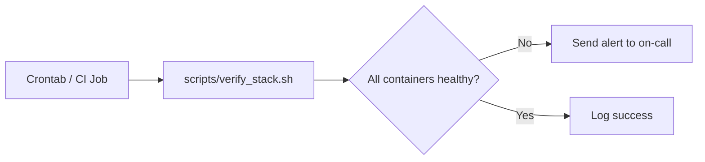

# Operations Runbook

Operational guidance for keeping the sensingCam MING stack healthy after day one. Use it as the base for shift handbooks and on-call procedures.

---

## Daily Tasks

| Task | Owner | Procedure |
|------|-------|-----------|
| Check Grafana dashboards | Shift Lead | Confirm live stream tile renders, event timeline updates, and alert panels are green. |
| Review Frigate storage | Maintenance | Ensure `./media` utilization below 80%. Delete or archive aging clips if retention policy exceeded. |
| Inspect Node-RED queue | Automation Engineer | Open editor, verify no flows show error badges, confirm MQTT nodes connected. |
| Validate MQTT broker | Controls Engineer | Run `mosquitto_sub -h <host> -t '$SYS/broker/clients/connected'` to confirm expected client count. |

---

## Weekly Tasks

1. Export Node-RED flows (`Menu → Export → Selected nodes`) and store in source control.
2. Run `scripts/verify_stack.sh` to ensure containers respond to health checks (requires `mosquitto_pub` from the `mosquitto-clients` package).
3. Confirm InfluxDB backups succeed (see [Backups](#backups)).
4. Review Grafana alerts for noise; tune thresholds if needed.

---

## Backups

| Asset | Frequency | Method |
|-------|-----------|--------|
| Node-RED `/data` volume | Weekly | `docker run --rm -v nodered_data:/data -v $(pwd)/backups:/backup alpine tar czf /backup/nodered-$(date +%F).tgz /data` |
| InfluxDB bucket | Daily | `influx backup --bucket machine_events ./backups/influx-$(date +%F)` |
| Grafana configuration | Weekly | Export dashboards as JSON and store with infrastructure-as-code repo. |
| Frigate media | Depends | Mirror to NAS/S3 using `rclone` or Frigate uploader. |

---

## Health Checks

- Configure the script output to push into OpsGenie/PagerDuty or simply send an email digest.
- Extend `verify_stack.sh` with application-specific checks (e.g., test Grafana API, fetch Frigate snapshot).

---

## Troubleshooting Recipes

### Camera recording not starting

1. Run `scripts/test_camera_api.sh` to confirm REST credentials.
2. Inspect Node-RED debug pane for rejected HTTP requests.
3. Check sensingCam web UI for active alarms or storage alerts.

### MQTT queue buildup

1. Inspect broker metrics via `$SYS/#` topics to identify slow consumers.
2. Restart stuck clients (`docker restart frigate`).
3. Increase broker persistence or switch to QoS 1 with retained messages.

### Grafana stream tile blank

1. Confirm Frigate `/live/<camera>` endpoint reachable (`curl http://localhost:8971/api/live`).
2. Validate reverse proxy headers (WebSocket upgrade) if exposed externally.
3. Reduce stream resolution for WAN viewers to avoid bandwidth saturation.

---

## Change Management

- Maintain a changelog of flow edits, dashboard tweaks, and configuration changes.
- Use feature branches + pull requests for Git-managed artifacts (flows, provisioning, scripts).
- Tag Docker Compose releases when promoting from staging → production to aid rollback.

---

## Contacts & Escalation

| Role | Contact | Escalation Path |
|------|---------|-----------------|
| Automation Engineer | automation@example.com | Slack `#automation`, phone escalation to Controls Manager. |
| IT Network Lead | network@example.com | ServiceNow ticket `Network - Industrial VLAN`. |
| Security Officer | security@example.com | PagerDuty rotation `Security-OnCall`. |

Update contacts after staffing changes and ensure on-call schedules cover maintenance windows.

---

## Known Gaps (Aligns with Roadmap)

- Grafana and Node-RED currently expose HTTP endpoints only. Introduce a reverse proxy with TLS and SSO during Phase 2.
- No default dashboards ship with the repo. Create and version-control JSON exports under `grafana/provisioning/` as part of the Phase 1 exit criteria.
- Health-check automation exists as `scripts/verify_stack.sh` but is not yet wired into cron/CI. Schedule it and connect alerts before production rollout.
