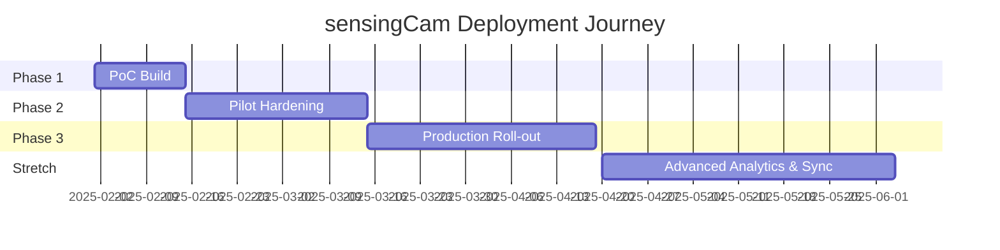

# Roadmap

A suggested progression from proof-of-concept to production. Adjust timelines and deliverables to match your organization's change management process.

---

## Phase 1 – Proof of Concept (Weeks 0-2)

- Validate sensingCam connectivity and REST control flow using `scripts/test_camera_api.sh`.
- Stand up the Docker Compose stack locally; ingest sample PLC events to Frigate.
- Instrument Node-RED flows to correlate Frigate clip paths with MQTT event metadata.
- Build an initial Grafana dashboard with a live restream panel and event timeline.
- Document lessons learned in [`docs/OPERATIONS.md`](OPERATIONS.md) for future onboarding.

**Exit Criteria**

- First anomaly-to-clip workflow demonstrated end-to-end.
- Stakeholders sign off on video quality, retention, and event metadata structure.

---

## Phase 2 – Hardened Pilot (Weeks 3-6)

- Enable TLS for Mosquitto and Grafana; integrate with enterprise identity provider.
- Deploy InfluxDB retention policies and downsampling tasks to manage clip metadata growth.
- Build Grafana dashboards that juxtapose live HLS playback with anomaly KPIs.
- Introduce automated health checks (`scripts/verify_stack.sh` in CI or cron) and alerting for service downtime.
- Conduct tabletop exercise covering credential rotation and incident response.

**Exit Criteria**

- Security review approved, with secrets stored in managed vault / Docker secrets.
- Operators trained on dashboards and escalation procedures.

---

## Phase 3 – Production Roll-out (Weeks 7-12)

- Deploy redundant brokers and databases (InfluxDB high availability / clustering strategy).
- Integrate predictive maintenance analytics leveraging Frigate object detection metrics.
- Automate firmware audits and backups for sensingCam devices via CI/CD pipelines.
- Mirror Frigate clips to object storage (S3/MinIO) with lifecycle policies.
- Implement centralized logging (Loki/ELK) with retention aligned to compliance requirements.

**Exit Criteria**

- SLA/SLO defined for camera uptime and clip availability.
- Disaster recovery plan validated via restore drill.

---

## Stretch Goals

- Evaluate Shinobi or other NVRs when ONVIF discovery or PTZ control is required.
- Add GPU acceleration (NVIDIA Jetson, Intel Quick Sync) for multi-stream transcoding.
- Expand Node-RED flows to publish events into ERP/MES systems or ticketing platforms.
- Deploy edge-to-cloud sync for summarized metrics using InfluxDB replication or Telegraf agents.
- Instrument ML anomaly detection on clip metadata to predict future failures.

---

## Visual Timeline

Use the diagram as a planning aid—update durations to match your sprint cadence.
