# Roadmap

A suggested progression from proof-of-concept to production. Adjust sequencing and deliverables to match your organization's change management process.

---

## Current Progress Snapshot

| Phase | Status | Notes |
|-------|--------|-------|
| Phase 1 – Proof of Concept | ⚙️ In progress | Compose stack, Node-RED flows, Frigate config, and verification scripts are committed. Awaiting hands-on camera validation and first Grafana dashboard import. |
| Phase 2 – Hardened Pilot | 🕒 Not started | TLS termination, retention policies, and alerting automation queued until Phase 1 exit criteria are met and credentials are issued. |
| Phase 3 – Production Roll-out | ⛔ Not started | Redundancy, off-host backups, and cloud mirroring will kick off after the pilot hardening cycle. |
| Stretch Goals | Backlog | Remain aspirational items to evaluate after steady-state production. |

---

## Phase 1 – Proof of Concept

- [x] Scaffold scripts and flows to validate sensingCam connectivity (`scripts/test_camera_api.sh`, `src/nodered/flows.json`).
- [x] Commit a Docker Compose stack that runs Mosquitto, Node-RED, Frigate, InfluxDB, and Grafana together.
- [x] Provide Node-RED flows that correlate Frigate clip paths with MQTT event metadata.
- [ ] Run the stack against a live sensingCam and ingest sample PLC events to confirm end-to-end behaviour.
- [ ] Build and import the first Grafana dashboard (JSON export) with live restream and event timeline panels.
- [ ] Document lab findings in [`docs/OPERATIONS.md`](OPERATIONS.md) after hardware validation.

**Exit Criteria**

- First anomaly-to-clip workflow demonstrated end-to-end against the target sensingCam.
- Stakeholders sign off on video quality, retention, and event metadata structure.

---

## Phase 2 – Hardened Pilot

- [ ] Enable TLS for Mosquitto and Grafana; integrate with enterprise identity provider.
- [ ] Deploy InfluxDB retention policies and downsampling tasks to manage clip metadata growth.
- [ ] Build Grafana dashboards that juxtapose live HLS playback with anomaly KPIs.
- [ ] Introduce automated health checks (`scripts/verify_stack.sh` in CI or cron) and alerting for service downtime.
- [ ] Populate `tests/` with repeatable smoke tests that exercise the compose stack in CI.
- [ ] Conduct tabletop exercise covering credential rotation and incident response.

**Exit Criteria**

- Security review approved, with secrets stored in managed vault / Docker secrets.
- Operators trained on dashboards and escalation procedures.

---

## Phase 3 – Production Roll-out

- [ ] Deploy redundant brokers and databases (InfluxDB high availability / clustering strategy).
- [ ] Integrate predictive maintenance analytics leveraging Frigate object detection metrics.
- [ ] Automate firmware audits and backups for sensingCam devices via CI/CD pipelines.
- [ ] Mirror Frigate clips to object storage (S3/MinIO) with lifecycle policies.
- [ ] Implement centralized logging (Loki/ELK) with retention aligned to compliance requirements.

**Exit Criteria**

- SLA/SLO defined for camera uptime and clip availability.
- Disaster recovery plan validated via restore drill.

---

## Stretch Goals

- Evaluate Shinobi or other NVRs when ONVIF discovery or PTZ control is required.
- Add GPU acceleration (NVIDIA Jetson, Intel Quick Sync) for multi-stream transcoding.
- Expand Node-RED flows to publish events into ERP/MES systems or ticketing platforms.
- Deploy edge-to-cloud sync for summarized metrics using InfluxDB replication or Telegraf agents.
- Instrument ML anomaly detection on clip metadata to predict future failures.

---

## Phase Sequencing Overview

```mermaid
flowchart TD
    Phase1[Phase 1 – Proof of Concept]
    Phase2[Phase 2 – Hardened Pilot]
    Phase3[Phase 3 – Production Roll-out]
    Stretch[Stretch Goals]

    Phase1 --> Phase2 --> Phase3 --> Stretch
```

Use the diagram as a planning aid—update milestone ordering to match your delivery cadence.
