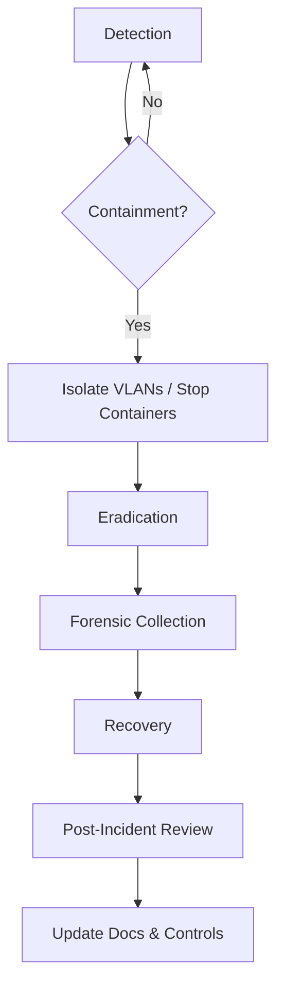

# Security Baseline

This document outlines a defense-in-depth posture for the sensingCam MING starter. Treat it as a living checklist—update it after security reviews or incident response exercises.

---

## Core Controls

1. **Change default credentials** – Update sensingCam (`main`/`servicelevel`), Mosquitto, Grafana, and InfluxDB credentials before exposing the stack.
2. **Use digest authentication** – The sensingCam REST API requires HTTP digest auth; scripts and automations should never fall back to basic auth.
3. **Transport security** – Terminate TLS at a reverse proxy for Grafana and Node-RED (the compose stack exposes HTTP by default). Enable MQTT TLS with per-topic ACLs to limit producers vs consumers.
4. **Network isolation** – Place cameras on an isolated VLAN; only Frigate and Node-RED should reach RTSP/HTTPS endpoints.
5. **Firmware integrity** – Validate SHA-256 checksums for camera firmware and keep the device on the latest signed release.
6. **Audit trails** – Configure InfluxDB and Grafana to emit audit logs (Docker volumes provided). Ship logs to a SIEM if available.
7. **Secret management** – Store long-lived tokens in Docker secrets or an external vault. Avoid committing real credentials to version control; use `src/.env.example` as the template.
8. **Least privilege** – Generate separate InfluxDB tokens for writes (Node-RED) and reads (Grafana). Mosquitto ACLs should prevent the camera from subscribing to command topics.

---

## Hardening Checklist

| Area | Recommendation | Validation |
|------|----------------|------------|
| sensingCam | Disable unused services (FTP, Telnet). Enforce HTTPS only. | Web UI > *Configuration* > *Network Services*. |
| Docker Host | Apply OS security updates, enable firewall (`ufw`, `firewalld`). | `uname -a`, package manager logs. |
| Mosquitto | Require TLS with client certs or strong passwords. Restrict topics per client. | `mosquitto_sub` test with invalid creds. |
| Node-RED | Enable `adminAuth`, disable projects if not needed, rotate credential secret. | Inspect `settings.js`. |
| InfluxDB | Create scoped API tokens, enable retention policies, configure backup script. | `influx auth list`, `influx backup`. |
| Grafana | Enable SSO (OAuth/SAML) or enforce strong local passwords, configure alert contact points. | Grafana admin UI > *Configuration*. |
| Reverse Proxy | Force HTTPS, add HSTS, enable Web Application Firewall (WAF) rules if exposed externally. | SSL Labs scan. |
| Grafana / Node-RED | Deploy behind the reverse proxy before leaving VLAN_APP; the repository ships without TLS or SSO enabled. | Access attempt outside VLAN should fail. |
| Logging | Forward Docker logs to centralized store (Loki, ELK). Enable camera syslog if available. | Review aggregator dashboards. |
| Automation | Keep `make checks` green (linting + compose health) before promotion. | CI logs referencing `tests/run.sh`. |

---

## Patch & Vulnerability Management

- Subscribe to **SICK PSIRT** advisories for sensingCam firmware announcements.
- Track CVEs for Mosquitto, Node-RED, InfluxDB, Grafana, and Frigate. Use tools like `trivy` or `grype` against container images.
- Schedule quarterly reviews to rebuild the stack on the latest base images (`docker compose -f src/docker-compose.yml pull && docker compose -f src/docker-compose.yml up -d`).

---

## Incident Response Playbook

1. **Detection** – Alerts from Grafana, SIEM, or anomaly detection.
2. **Containment** – Isolate affected VLANs, revoke compromised tokens.
3. **Eradication** – Patch vulnerabilities, rotate secrets, redeploy containers.
4. **Recovery** – Restore services from clean backups, validate with smoke tests.
5. **Post-Incident Review** – Update runbooks, patch levels, and share lessons learned.

Document each incident in [`docs/OPERATIONS.md`](OPERATIONS.md) with timestamps, impact, and remediation steps.

---

## Compliance Considerations

- **Audit Logging**: Retain InfluxDB and Grafana audit logs for the duration mandated by your compliance program.
- **Data Residency**: If clips are exported offsite (S3, cloud analytics), ensure storage regions meet corporate policy.
- **Access Reviews**: Perform quarterly access reviews of MQTT users, InfluxDB tokens, and Grafana accounts.
- **Segregation of Duties**: Separate responsibilities between automation engineers (Node-RED) and security teams managing credentials.

---

## Security Testing Ideas

- Run **Nmap** scans from VLAN_APP to confirm only expected ports are open on the sensingCam.
- Use **Burp Suite** or **OWASP ZAP** to test reverse proxy hardening (without disrupting production).
- Perform **tabletop exercises** simulating credential compromise or camera outage to ensure operators know the playbook.
- Integrate **CI/CD security checks** (SAST, dependency scanning) when customizing flows or scripts.

Security is a continuous process—make updates whenever new services, dashboards, or integrations are introduced.
