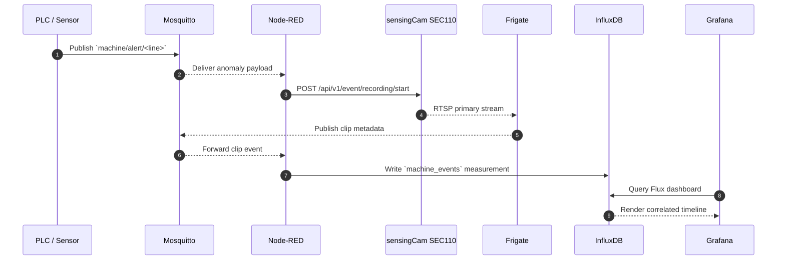

# Data Flow and Integration Points

This reference describes how events traverse the sensingCam MING Starter.

## Sequence Overview

## Topic and Bucket Map
| Source | Destination | Payload | Notes |
|--------|-------------|---------|-------|
| PLC | Mosquitto | `machine/alert/<asset>` | JSON containing `line`, `station`, and `severity`. |
| Node-RED | sensingCam | REST POST | Camera credentials pulled from environment variables. |
| Frigate | Mosquitto | `frigate/events` | Clip metadata with `id`, `label`, `event_type`. |
| Node-RED | InfluxDB | `machine_events` | Tags for `line`, `station`, `severity`; fields include clip URL. |

## Storage Layout
- Frigate media is persisted in the `./media` volume configured in `docker-compose.yml`.
- InfluxDB stores data in the `machine_events` bucket with a default 30-day retention (override via environment variables).
- Grafana dashboards are provisioned from `src/grafana/provisioning/`.

## Networking Notes
Review VLAN boundaries, firewall ports, and cross-zone dependencies in [`diagrams/io_map.md`](diagrams/io_map.md).
