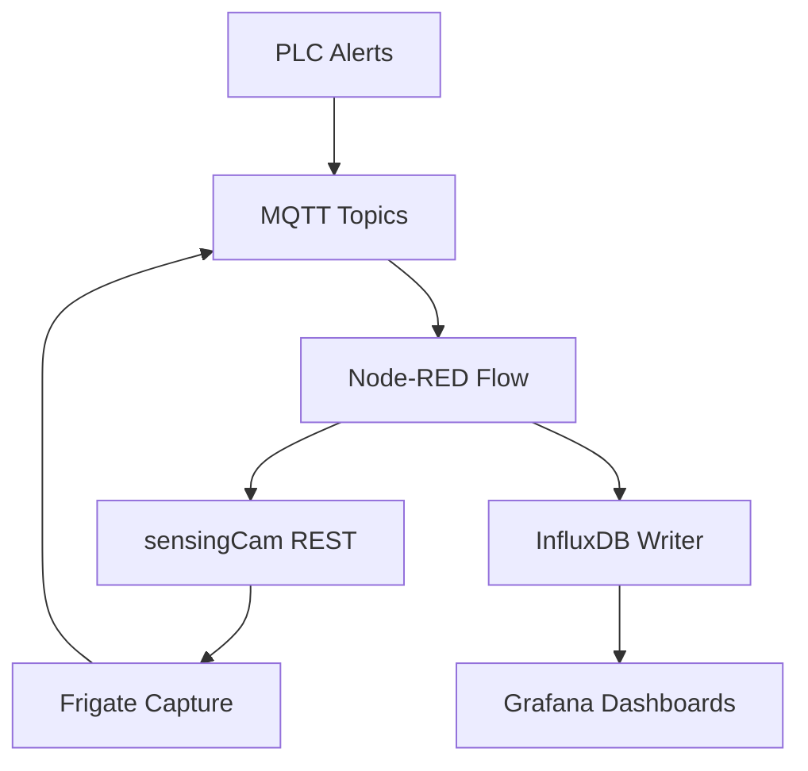

# Module Interaction Graph

```mermaid
graph TD
    A[PLC Alerts] --> B[MQTT Topics]
    B --> C[Node-RED Flow]
    C --> D[sensingCam REST]
    C --> E[InfluxDB Writer]
    D --> F[Frigate Capture]
    F --> B
    E --> G[Grafana Dashboards]
```

Use this mermaid source as the baseline when introducing new microservices or integrations.
