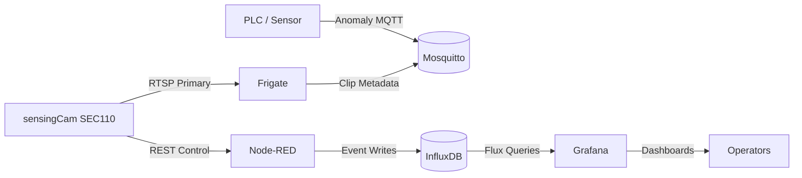

# System Overview Diagram

```mermaid
flowchart LR
    PLC[PLC / Sensor]
    MQTT[(Mosquitto)]
    NR[Node-RED]
    CAM[sensingCam SEC110]
    FR[Frigate]
    TS[(InfluxDB)]
    GF[Grafana]
    Ops[Operators]

    PLC -->|Anomaly MQTT| MQTT
    CAM -->|RTSP Primary| FR
    CAM -->|REST Control| NR
    FR -->|Clip Metadata| MQTT
    NR -->|Event Writes| TS
    TS -->|Flux Queries| GF
    GF -->|Dashboards| Ops
```

Export this mermaid definition to SVG or PNG when needed for presentations.
